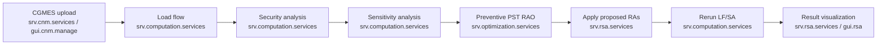

# Python-to-Java Migration Validation Playbook

## Decision

**Migration sign-off: NOT APPROVED.**

The target architecture and the complete eight-stage workflow are present, but
the audit found result-affecting Python behavior that is absent or materially
different in the Java implementation. This document is therefore a migration
playbook and gap register, not a declaration of functional equivalence.

Audit baseline:

- Source archive: `pytsc-main.zip`
- Source archive SHA-256: `6b9d91b516034f05e854c424b902ac0fbe457c1a3dc1a7e9e0e1f532625cf07b`
- Source archive revision recorded in the ZIP: `526b66b349256ded07986c5285a2994bc248fa8f`
- Java repository revision: `8e14b7470720285e9a39b429dfc5b1741b5615c9`
- Audit date: 2026-07-03

The audit treats executable Python behavior as the baseline. Empty pages,
comments, TODOs, roadmap items, formatting helpers, and PowerFactory-specific
bootstrap mechanics are not considered business logic. PowerFactory behavior
must be implemented through PowSyBl, and Gurobi behavior must be implemented
through SCIP, as required by the target rules.

## Target flow and ownership



`srv.computaion.services` was normalized to
`srv.computation.services`; the former contains a spelling error.

## Technology-rule validation

| Rule | Evidence | Status |
|---|---|---|
| Java, Spring, REST | Java 21 Maven reactor and Spring Boot REST applications in the four `srv.*` modules | Implemented |
| OpenAPI | Checked-in contracts under each service's `src/main/resources/openapi` | Implemented |
| JUnit and Mockito | JUnit tests across adapters/services; Mockito used in service orchestration tests | Implemented, coverage incomplete |
| Vue or React | Vue/Vite applications in `gui.cnm.manage`, `gui.rsa`, and `gui.common` | Implemented |
| Elasticsearch | `com.infra` document repository adapter | Implemented |
| MinIO | `com.infra` object-storage adapter | Implemented |
| PostgreSQL | PowSyBl network store and RSA JDBC workflow metadata | Implemented |
| RabbitMQ | `com.infra` event publisher | Implemented |
| Camunda | Docker service and `BusinessProcessService` port exist, but the business flow is not deployed as a Camunda process | **Partial** |
| Maven | Root reactor, dependency management, and module POMs | Implemented |
| Docker local build | Compose stack and per-application Dockerfiles | Implemented |
| PowSyBl replaces PowerFactory | PowSyBl calls are isolated in `com.powsbl`; no PowerFactory dependency remains | Implemented structurally |
| SCIP replaces Gurobi | Neutral MILP model, LP writer, and SCIP command adapter in `com.solver` | Implemented structurally |

## Source-to-target traceability

### Application shell and shared utilities

| Python source | Migrated target | Assessment |
|---|---|---|
| `src/app.py`, `src/home.py`, `src/core/ui/sidebar_actions.py` | `gui.cnm.manage`, `gui.rsa`, `gui.common` | Replaced by Vue applications and shared components. The step sequence exists, but backend workflow state is not updated for every step. |
| `src/core/config.py`, `config.ini` | Spring `application.yml`, environment properties, `com.utils`, `com.vault` | Replaced by environment-driven Spring configuration. |
| `src/core/logger.py` | Spring Boot/SLF4J runtime logging | Platform replacement; no business behavior lost. |
| `src/core/json_utilities.py`, `src/core/store_results.py`, `src/core/pf/store_pf_results.py` | Jackson REST DTOs plus MinIO, Elasticsearch, and PostgreSQL adapters | Storage mechanism replaced. Result artifacts are not yet persisted with the same run-level detail. |

### CGMES loading and model metadata

| Python source/behavior | Java target | Assessment |
|---|---|---|
| `core/olf/powsybl_solver.py::read_network` and `core/pf/cgm_*` | `srv.cnm.services`, `PowsyblCnmNetworkImportAdapter`, `PowsyblNetworkRepository` | CGMES ZIP/XML import is implemented through PowSyBl/network-store. |
| Uploaded ZIP expansion and safety | `SafeArchiveExpander` | Implemented with traversal, size, and nesting limits. |
| `collect_model_metadata.py::profile_status_from_zip` | Filename metadata in `ProfileFilenameParser` | **Partial:** EQ/SSH/SV/TP presence diagnostics are not returned. |
| `collect_model_metadata.py::collect_model_metadata` | `CnmNetworkSummary` | **Partial:** basic network counts exist; raw tag counts, tie-line component reconciliation, missing equipment samples, and TP connectivity reconciliation are absent. |
| `collect_model_metadata.py::check_expected_equipment` | No equivalent | **Not migrated.** |

### Load flow

| Python behavior | Java target | Assessment |
|---|---|---|
| Configurable PowSyBl/OpenLoadFlow parameters in `config_olf_lf.py` | `LoadFlowRequest.parameters` and `PowsyblLoadFlowAdapter` | **Partial:** the request carries a parameter map, but the adapter ignores it except for AC/DC mode. |
| AC/DC execution and convergence | `PowsyblLoadFlowAdapter` | Implemented through PowSyBl. |
| Branch `p/q/i` on both sides, three-winding transformer sides, permanent current limits, and loading percentage | `LoadFlowResult` | **Partial:** only terminal-1 active power and worst two-terminal branch current are returned. Reactive power, side values, limits, loading, and three-winding results are absent. |

### Security analysis and contingencies

| Python behavior | Java target | Assessment |
|---|---|---|
| `parser_contingencies.py` NCP XML parsing | Structured `CnmContingency` REST input | **Partial:** callers can submit contingencies, but NCP upload/XML parsing is absent. |
| Single-element contingency execution | `PowsyblSecurityAnalysisAdapter` | Implemented for branch contingencies. |
| Pre- and post-contingency statuses/violations | `SecurityAnalysisResult` | **Partial:** post-contingency violations and failed contingency IDs are returned; pre-contingency violations/status are not mapped. |
| Current-only violation view used by the prototype | All PowSyBl limit types in `CnmViolation` | Intentional superset, but consumers need an explicit current filter for parity. |

### Sensitivity analysis

| Python behavior | Java target | Assessment |
|---|---|---|
| Restrict factors to selected monitored branches and authoritative PSTs | `SensitivityAnalysisRequest` | Caller-controlled selection exists. Network/main-island and authoritative-profile validation are absent. |
| Calculate `BRANCH_CURRENT_1` and `BRANCH_CURRENT_2` | `PowsyblSensitivityAnalysisAdapter` | **Partial:** only `BRANCH_CURRENT_1` is calculated. |
| Preserve the sign and magnitude of the worst terminal-side sensitivity | No equivalent | **Not migrated; result-affecting blocker.** |
| Convert A/degree to A/tap-step using phase-tap step alpha differences | Profile snapshot is assumed to already contain usable coefficients | **Not migrated/verified; result-affecting blocker.** |

### Preventive PST RAO input preparation

| Python source/behavior | Java target | Assessment |
|---|---|---|
| Safe RAO ZIP classification and nine required CSV files | `PstProfilePackageParser` | Required files, safe entry names, duplicate files, and per-file size limits are implemented. XML compatibility classification is not carried forward. |
| CSV schema, types, duplicate keys, foreign keys, and control parameter validation | `PstProfilePackageParser` | **Partial:** many used fields are parsed strictly, but complete required-column checks, all foreign keys, TSO references, enum checks, timestamp availability across every table, and finite-value checks are not equivalent. |
| Deterministic unique labels (`name`, `name#2`, ...) | Raw asset name used as label | **Not migrated; duplicate names can collide in MILP variables.** |
| Network-derived PST current tap, technical limits, alpha step data, main-island membership, and controllability | Values trusted from CSV; snapshot contains only currents and sensitivities | **Not migrated; result-affecting blocker.** |
| Authoritative availability/optimize and group exclusion | `PstProfilePackageParser` | Broad policy implemented for one timestamp. |
| Online > offline > IGM operational bound priority, per direction | `operationalBounds` | **Partial:** one global source priority is selected rather than priority independently per direction; `upanddown`/incremental handling is not equivalent. |
| Monitored branch existence, type, main-island membership, side currents, and side limits | CSV plus `RaoAnalysisSnapshot` | **Partial:** side-limit minimum and snapshot presence are checked; branch type/network/main-island consistency and side-wise current selection are not. |
| One or multiple timestamps | Neutral request/model supports multiple timeframes | **Partial:** the profile-package API parses only one timestamp and creates one timeframe. |
| `PenaltyReferencePSTpreventive × RAPenaltyFactor` per-PST cost | `preventiveTapChangeCost × RAPenaltyFactor` | **Different coefficient; result-affecting blocker.** |

### Preventive PST RAO optimization

The core linear model in `rao_milp_build.py` is represented by
`PreventiveRaoProblemMapper` and serialized by `LpFileWriter` for SCIP.

Implemented equations include:

- integer PST tap position and technical/operational bounds;
- absolute tap change from the current tap;
- scheduled total movement;
- current-domain linearization
  `I[l] = I0[l] + sum(S[l,p] * (tap[p] - tap0[p]))`;
- positive and negative current-limit overload slack;
- group equality constraints;
- per-TSO timestamp movement limits and slack;
- per-PST optimization-timeframe movement limit and slack;
- overload, preventive movement, TSO, OT, and technical-limit penalties;
- multi-timeframe variable and constraint construction.

The equation shape is substantially migrated. It cannot be certified equivalent
until the upstream coefficients and labels are corrected and golden-model tests
compare the generated Java LP with Python model fixtures. Current Java tests only
prove basic LP syntax and a small action-mapping scenario.

`rao_milp_solve.py` used Gurobi. `ScipCommandSolverAdapter` is the required
open-source replacement and maps optimal, feasible, infeasible, timeout, and
error outcomes. The richer Python result summary—tap series, predicted branch
currents, overload series, and objective component values—is not exposed by the
Java `RemedialActionResult`.

### Apply, rerun, comparison, and visualization

| Python behavior | Java target | Assessment |
|---|---|---|
| Apply selected PST tap positions | `PowsyblNetworkUpdateAdapter`, `RsaWorkflowService.apply` | Implemented for two-winding transformers with phase tap changers. Rejection is reported for unresolved actions. |
| Rerun LF, stop on non-convergence, then rerun SA | `ComputationService.rerun` | Implemented. |
| Capture each workflow step, timing, logs, structured failure, and run metadata | `RsaWorkflowState`, JDBC metadata, RabbitMQ events | **Partial:** only create/apply/complete transitions are persisted; intermediate steps, timings, and structured failure context are not orchestrated. Camunda is not wired. |
| Pre/post overload counts, overload amperes, resolved violations, SA aggregates, and per-branch table | `RsaWorkflowService.compare` | **Partial:** only absolute-current improvement/worsening is classified. Limits, loading percentages, overload amounts, and SA KPIs are absent. |
| Interactive network topology, buses, voltage levels, loads/generators, branch status/loading, and detail panels in `lf_visualization.py` | `gui.rsa` JSON timeline | **Not migrated; the current UI is a raw JSON result viewer.** |

## Blocking gap register

All items below must be closed before changing the decision to **APPROVED**.

| ID | Required change | Owning modules | Minimum acceptance evidence |
|---|---|---|---|
| MIG-01 | Map supported OpenLoadFlow parameters and return side-wise LF values, limits, loading, and three-winding results. | `data.cnm`, `com.powsbl`, `srv.computation.services` | Parameter-mapping unit tests plus CGMES golden-result test. |
| MIG-02 | Add NCP XML ingestion and map pre-/post-contingency status and current violations. | `srv.cnm.services` or `srv.computation.services`, `com.powsbl` | Parser tests using prototype NCP fixtures and PowSyBl integration test. |
| MIG-03 | Calculate both current sensitivity sides, select the conservative signed value, and convert coefficients to A/tap-step. | `com.powsbl`, `data.cnm` | Unit fixture proving side selection and a PowSyBl PST integration test. |
| MIG-04 | Build RAO inputs from the loaded network: main island, object type/existence, PST controllability, tap steps, current taps, and technical bounds. | `com.powsbl`, `srv.optimization.services` | Golden preprocessing tests against the prototype CSV and CGMES fixtures. |
| MIG-05 | Complete CSV validation, unique labels, per-direction source priority, multi-timestamp package parsing, and the reference-cost formula. | `srv.optimization.services` | Port the Python preprocessing test cases and assert equivalent DTOs. |
| MIG-06 | Expose predicted currents, overloads, objective components, tap outcomes, and solver diagnostics. | `com.solver`, `data.cnm`, `srv.optimization.services` | Java/Python golden-model comparison for single and multiple timeframes. |
| MIG-07 | Persist and publish every workflow transition, timing, and structured failure; deploy the orchestration with Camunda. | `srv.rsa.services`, `com.infra` | Workflow integration test covering success, skipped SA, LF failure, and solver failure. |
| MIG-08 | Restore pre/post LF and SA KPIs and a branch-level visualization model. | `data.cnm`, `srv.rsa.services` | KPI fixture parity tests. |
| MIG-09 | Implement the interactive result visualization rather than raw JSON output. | `gui.rsa` | Component/E2E tests for topology, limits, loading state, and pre/post comparison. |
| MIG-10 | Restore profile diagnostics, import reconciliation, and expected-equipment checks where these remain operational requirements. | `srv.cnm.services`, `com.powsbl` | Tests using FullGrid/MicroGrid prototype packages. |
| MIG-11 | Run an end-to-end regression with real CGMES, NCP, PST profile, and SCIP fixtures. | all flow modules | Archived inputs/outputs and tolerance-based comparison report. |

## Closure procedure

For each blocking item:

1. Create a fixture from the source archive without copying Python runtime or
   commercial-engine dependencies into production modules.
2. Record the Python input, normalized intermediate values, and expected output.
3. Implement the behavior behind neutral `data.cnm` contracts.
4. Keep all direct PowSyBl imports inside `com.powsbl` and all SCIP process/LP
   details inside `com.solver`.
5. Add JUnit tests for rules and Mockito tests for orchestration. Use an
   integration test for every PowSyBl or infrastructure boundary.
6. Update the relevant OpenAPI contract and Vue client in the same change.
7. Run the validation commands below and attach the golden comparison output.
8. Mark an item closed only after review confirms semantic parity, including
   units, signs, terminal-side selection, timestamp behavior, and failure paths.

## Validation commands

```bash
mvn -Dmaven.repo.local=work/m2 clean test
mvn -Dmaven.repo.local=work/m2 -DskipTests package
npm --prefix gui.common ci
npm --prefix gui.common run build
npm --prefix gui.cnm.manage ci
npm --prefix gui.cnm.manage run build
npm --prefix gui.rsa ci
npm --prefix gui.rsa run build
docker compose -f docker/docker-compose.yml config
```

Boundary checks:

```bash
rg 'import com\.powsybl' --glob '*.java' --glob '!com.powsbl/**'
rg -i 'powerfactory|digsilent|gurobi|gurobipy|pyomo|pypowsybl' \
  --glob '!**/target/**' --glob '!**/node_modules/**' --glob '!**/dist/**'
```

Both boundary scans must return no production-code matches. References in this
playbook are expected because it records the migration source and replacement
decisions.

## Sign-off record

The playbook may be changed to **APPROVED** only when MIG-01 through MIG-11 are
closed, Maven and frontend builds pass, Compose validates, and the end-to-end
golden run demonstrates equivalent decisions and engineering quantities within
documented tolerances. Until then, the repository is an architectural migration
with partial functional parity, not a complete migration of all Python business
logic.
